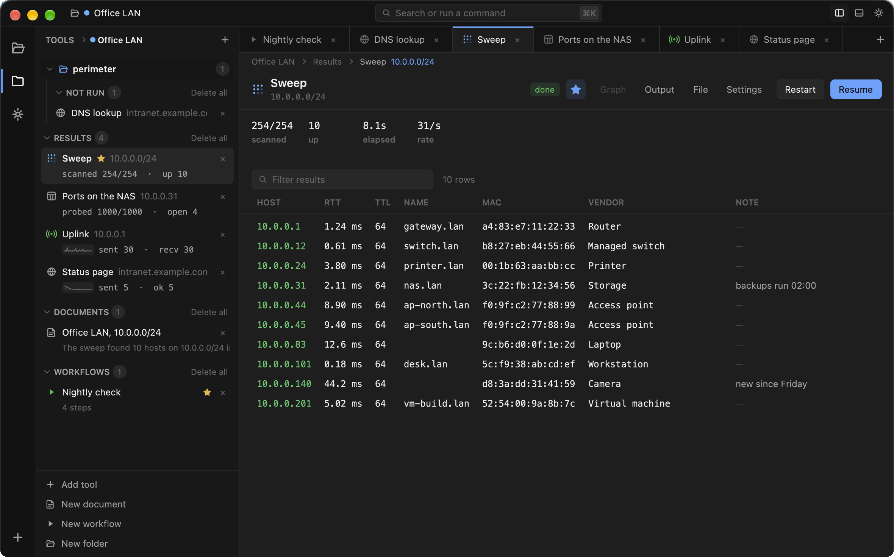
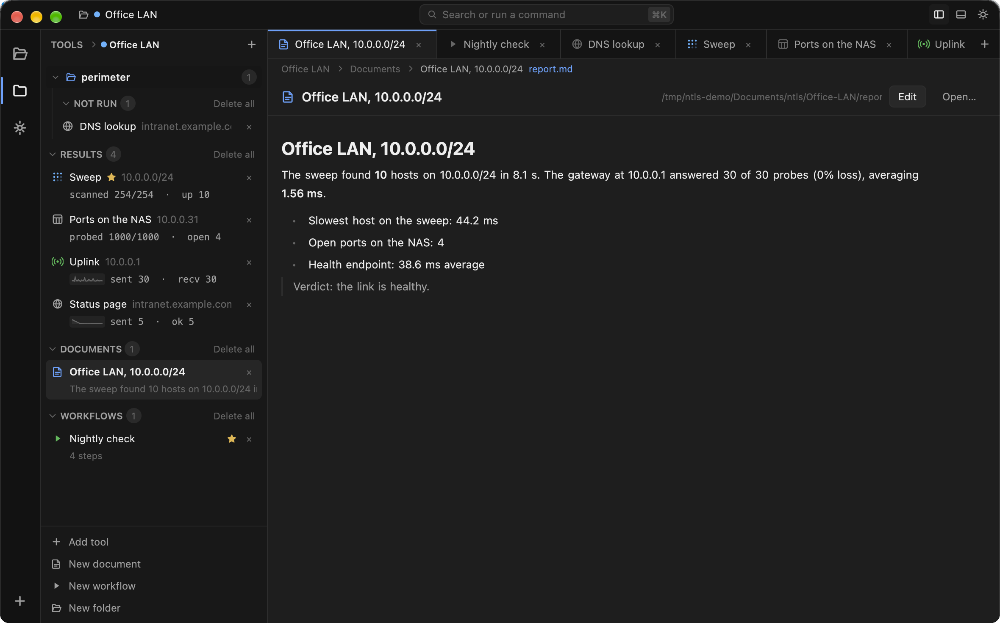
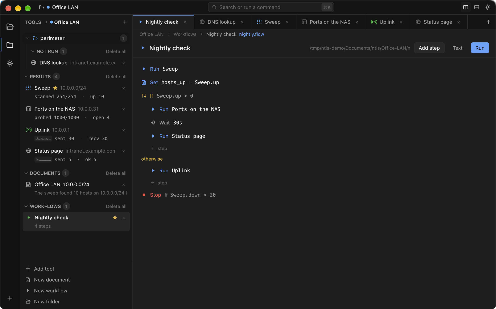

# ntls

A desktop app for the network questions that come up over and over: is this
host up, what else is on this subnet, what is it listening on, what does that
endpoint actually return. Whatever it finds gets saved as a file in a directory
you can open, and you can write notes and small automations on top of the
results.



Runs on macOS, Linux and Windows, on Intel and ARM. Written in Rust using
[GPUI](https://gpui.rs).

## Tools

| Tool | What it does |
| --- | --- |
| Ping | Probes one host continuously. Live loss, min/avg/max/mdev, latency graph. |
| Traceroute | Maps the routers to a host. Hops are probed in parallel, so a full trace takes seconds. |
| IP scan | Sweeps a subnet or range, lists what answers, with reverse DNS, MAC and vendor. |
| Port scan | TCP, UDP or both. A list, a range, or all 65535, with banner reading. |
| DNS lookup | A, AAAA, CNAME, MX, NS, TXT, SOA, SRV, PTR, against any server you like. |
| HTTP request | Sends a request, checks the answer is what you expected, pulls a value out of it. |
| Subdomains | Subdomains from certificate transparency logs, searchable and sortable. |
| Internet speed | Download, upload and latency against a public endpoint or a URL you name. |
| LAN throughput | Actual speed between two machines running ntls. The peer is found by broadcast. |
| Download | Paste one link or twenty. It works out what each one is and fetches them, resumably. |

Ping and the IP scan can work over ICMP or ARP. ICMP reaches anything routable.
ARP only works on your own link, but it finds devices that ignore pings, and
it's the only way to get a real hardware address out of one. Both are spoken
directly rather than by shelling out to `ping` or `arp`, so a /24 sweep runs on
a single socket.

### HTTP checks

The HTTP tool sends whatever you tell it to: any method, query parameters
(escaped for you), headers, Basic or Bearer credentials, a body as text, JSON
or form. It can go through a proxy, follow redirects or not, force HTTP/1.1,
and skip certificate checking for the appliance in the rack with a self-signed
cert.

Two fields make it a check rather than just a request. **Expect** says what a
good answer is: `any`, `2xx`, `404`, `200-204`, or a list. Anything else turns
the row red and says what you asked for. **Capture** pulls one value out of
every response into its own column, either a path into the JSON (`data.queue`,
`items[0].id`), a header (`header:X-Request-Id`), the status, or the raw body.

If what you capture is a number it gets graphed next to the response time, and
it shows up in the run's summary, so `{{ "Status page".value.last() }}` works
in a document. Set the request count to 60 with a one minute interval and
you've got a monitor.

## Installing

CI builds every platform on every push, and tagging `v*` publishes a release
with:

- **macOS** `ntls.app` in a zip, one universal build for Intel and Apple
  silicon.
- **Windows** an installer, plus a portable zip that's just the `.exe`. x64 and
  ARM64.
- **Linux** a tarball with the binary, an icon, a `.desktop` file and an
  `install.sh` that drops them under `~/.local`. x86-64 and aarch64.

The macOS build is ad-hoc signed rather than notarised, so the first launch
needs a right-click, then Open. Or:

```
xattr -dr com.apple.quarantine ntls.app
```

Or build it yourself, see [Building](#building).

## Using it

A workspace is one investigation. It holds the tools you opened, what they
found, and any notes or workflows you wrote about them. The tabs across the top
switch between investigations rather than between tools.

Press `⌘K` (`Ctrl+K` off macOS) for the command bar. Type a tool's name and hit
return to get its form, or type the whole thing and skip the form entirely:

```
ping 10.0.0.1
ping 10.0.0.1 count=10 interval=500ms
ipscan 10.0.0.0/24 method=arp
portscan 10.0.0.31 ports=top
dns example.com type=MX
http https://example.com/health count=5 expect=2xx
```

Bare words go into whatever the tool calls its target. `key=value` fills in
anything else, matched against either the setting's key or its label. The bar
shows you what return is about to do before you press it.

Tab is worth knowing about. It completes whatever is highlighted, and it also
expands shorthand a step at a time so you can see and edit what you're about to
run:

```
auto  →  10.0.0.0/24  →  10.0.0.1-10.0.0.254
all   →  1-65535
top   →  21-23,25,53,67-69,80,110,111,123,135,137-139,…
```

That same box searches everything you have open, not just the tool list:
workspaces, open tools, documents by a line inside them, workflows by a run
they start, network interfaces, and every row of every result table. An address
you scanned last week is one query away, and picking it opens the workspace,
the tool and the row.

`⌘R` runs, `⌘.` stops. Stopping keeps what was found, and the buttons become
Resume and Restart. The IP scan and DNS lookup also have a *Keep earlier
results* switch: with it on, a new run adds to the table instead of replacing
it, so a host that's gone quiet keeps its row, and an address that a different
device has taken over gets a second row next to the first.

Click a column heading to sort, drag its edge to resize, `⌘F` to filter. Every
row has a NOTE you can type into. Notes are attached to the workspace rather
than to the run, so something you jotted down while reading a sweep is still
there in the port scan you do next. Select a row and a Send bar appears: pick a
host out of a sweep, one click, and it's in the port scanner with the port
filled in.

There's also *Compare with…* in a run's menu, which diffs it against another
run of the same tool (appeared, went, changed), and *Export as CSV…*, which
writes out exactly what's on screen, filter and sort order included.

Right-click things. Workspaces, tools, documents, workflows, group headings,
result rows, interfaces, the background. The menu is about whatever is under
the pointer.

## Files on disk

A workspace is a directory. Everything in it is a file:

```
~/Documents/ntls/
  office-lan/
    workspace.json      name, colour, notes, variables
    001-ipscan.json     one tool: its settings and its results
    002-portscan.json
    report.md           a document
    nightly.flow        a workflow
    perimeter/          a folder with more of the same
      003-dns.json
```

Writes happen as things change and everything is read back at startup, so last
week's results are still there, rows and log and charts included. Copy a
workspace somewhere, delete one by hand, whatever you like.

The side bar lists folders first, then whatever is loose in the workspace,
grouped by where each tool has got to (Not run, Running, Results) with the
documents and workflows below. Any heading can be emptied, and it empties the
one you clicked rather than every heading with that name.

The page button at the top of that side bar flips it into a file view: the same
workspace listed the way the filesystem has it, with real names and sizes,
folders, and `.closed`, which is where anything you remove ends up. Nothing
here is deleted by a single click. Clicking a file opens whatever it is, and
files ntls doesn't recognise get handed to your file manager.

## Documents

*New document* makes an empty `.md` file next to the tools and opens it split:
source on one side, rendered on the other, updating as you type.

The useful part is that anything in double braces is an expression, evaluated
against the tools in the same workspace every time the document is displayed.



That one is written like this:

```markdown
# Office LAN, {{ subnet }}

The sweep found **{{ Sweep.up }}** hosts on {{ subnet }} in
{{ fixed(Sweep.elapsed, 1) }} s. The gateway at {{ gateway }} answered
{{ Uplink.recv }} of {{ Uplink.sent }} probes ({{ Uplink.loss }} loss),
averaging **{{ fixed(Uplink.rtt.avg(), 2) }} ms**.

- Slowest host on the sweep: {{ fixed(Sweep.rtt.max(), 1) }} ms
- Open ports on the NAS: {{ "Ports on the NAS".rows }}
- Health endpoint: {{ fixed("Status page".time.avg(), 1) }} ms average

> Verdict: {{ if Uplink.rtt.avg() < 5 then "healthy" else "gateway is slow" }}.
```

A tool that hasn't run yet evaluates to nothing rather than an error, so you
can write the document before the scan. An expression that's genuinely wrong is
left in place, in red, with the reason.

The editor highlights as you type and completes what it knows about: runs in
this workspace, variables, the columns and summary figures of whatever run you
named before the dot, and the language's functions. Tab accepts, arrows walk
the list, escape dismisses.

*Open in another editor…* hands the file to whatever you normally write
markdown in. That's the only thing that does.

## Workflows

Most network questions take more than one tool, and not always the same ones.
You sweep, and then port scan whatever answered, or give up if nothing did. A
workflow writes that down, and you build it by clicking.



*Add step* offers the six kinds. Every block ends in a faint `+ step` for
putting one inside a branch or a repeat. Click a step and its controls appear
on its line: which run a `run` starts, how many passes a `repeat` does, how
long a `wait` waits.

Conditions are picked, not typed. *only if* opens four controls (which run,
which of its figures, how to compare, what to compare against) and each one
only offers what actually exists. `⌃`/`⌄` move a step among its neighbours, `+`
opens everything else you can do to it, `×` deletes it. Click empty space, or
press return or escape, to put the controls away.

Steps are colour-coded: blue does work, amber decides, green loops, grey waits,
red stops.

The file underneath is text, and the two stay in sync. *Text* shows the source
and lets you edit it directly, edits there show up in the controls as you type,
and edits with the controls show up in the text.

```text
# Nightly check

run "Sweep"
set hosts_up = Sweep.up
if hosts_up > 0 {
  run "Ports on the NAS"
  wait 30s
  run "Status page"
} else {
  run "Uplink"
}
stop if Sweep.down > 20
```

| Step | Does |
| --- | --- |
| `run "Name"` | Starts a run in this workspace and waits for it |
| `if … { } else { }` | Branches |
| `repeat 3 { }` | Repeats a fixed number of times |
| `wait 30s` | Pauses |
| `set name = expression` | Works something out and keeps it |
| `stop` | Ends the workflow |

`run` and `stop` can carry their own `if`. Conditions are evaluated when the
step is reached, not when the workflow starts, which is the entire point: a
step gets to see what the steps before it found. A step whose condition is
false is skipped and says so. A run that fails stops the workflow, since
carrying on would mean acting on results that don't exist.

## Expressions

The same small language works inside `{{ }}` in a document, in a workflow's
conditions, and on the right hand side of `set`.

Name a run by whatever you called it, or by its tool:

```
Sweep.up          the run called Sweep
ipscan.rows       the only IP scan in this workspace
"Port scan".open  quotes, if the name has a space in it
tool("Port scan") same thing, spelled out
```

Every run answers to `rows`, `up`, `down`, `warn`, `target`, `state`, `ok`,
`elapsed` and `name`. It also answers to any of its columns by name
(`Sweep.rtt`, `Sweep.vendor`), which gives you a list with one entry per row,
and to any figure from its summary (`Uplink.loss`, `Sweep.scanned`).

Columns are text with units in them. The arithmetic reads the number out, so
`Sweep.rtt.avg()` averages `"12.4 ms"` and skips rows that never answered.

Functions, which you can also write as methods (`avg(x)` and `x.avg()` are the
same thing):

```
avg  min  max  sum  count  median  p95  percentile
round  floor  ceil  abs  fixed  percent
first  last  join  text  upper  lower  number
exists  tool  tools
```

Plus `if … then … else …`, the usual arithmetic and comparisons, and `&&`,
`||`, `!` (or `not`). No loops, no definitions, no side effects.

```
{{ if Sweep.up == 0 then "nothing answered" else Sweep.up + " hosts" }}
{{ fixed(percent(Sweep.up / Sweep.rows), 1) }}
{{ Sweep.host.join(", ") }}
```

## Variables

Variables belong to the workspace rather than to any run in it, and everything
in the workspace can read them by name. They come in two flavours: plain text,
and formulas. A formula holds an expression that gets evaluated every time it's
read, so `gateway = Sweep.host.first()` follows the sweep, while the same thing
stored as text is whatever the sweep said on the day you wrote it down.

The Variables section in the side bar is where they live. Each row shows the
name, what it currently comes to (a formula shows its answer with the
expression underneath), and a line about where the value came from and what
reads it:

```
gateway     10.0.0.1                       =  ×
            = Sweep.host.first()
            read by Office LAN, 10.0.0.0/24

hosts_up    10                             =  ×
            set by Nightly check · 8 min ago

subnet      10.0.0.0/24                    =  ×
            the network this workspace is about
```

Click the name to rename, the value to retype it, the bottom line to write a
note about what it's for, and `=` to switch between text and formula. The text
is kept either way, so an expression you typed as text starts working the
moment you flip it. A formula that can't be evaluated shows the reason in red
where its answer would go. One that refers to itself, directly or in a circle,
comes back empty rather than hanging.

"Read by" is worked out from the documents, workflows and other formulas that
actually mention the name, so a variable nothing uses says so.

### Workflows write them

A `set` step evaluates an expression when the step is reached and keeps the
answer:

```text
run "Sweep"
set hosts_up = Sweep.up
run "Ports on the NAS" if hosts_up > 0
```

You don't have to type any of that. The name comes from the variables you
already have, and the value is picked the same way a condition is: which run,
which figure, and how to reduce a column of many rows to one value (`as it is`,
`avg`, `max`, `count`, `first`, and so on). The step shows what it would keep
while you're building it:

```
Set [hosts_up] = [Sweep] [up] [as it is]  → 10
```

Anything too involved for those controls you type instead, and it's marked *as
written*. When the workflow runs, the trail against that step says what it set,
and the variable remembers which workflow wrote it and when.

Conditions can be about a variable as easily as about a run. Pick a variable as
the subject and the "which figure" control disappears, because a variable is
already a value: `if [hosts_up] [is more than] [0]`.

If a run and a variable share a name, the run wins.

## Keyboard

Written the macOS way. On Windows and Linux every ⌘ is Ctrl.

| Where | Keys |
| --- | --- |
| Adding | `⌘K` command bar, `⌘1`–`⌘9` add that tool directly |
| Workspaces | `⌘T` new, `⌘⇧W` close, `⌘⇧[` / `⌘⇧]` previous/next |
| Tools | `⌘[` / `⌘]` previous/next, `⌘W` close the tab (tool stays) |
| A run | `⌘R` run, `⌘.` stop, `⌘E` settings, `⌘I` rename, `⌘G` big graph |
| Layout | `⌘B` side bar, `⌘J` output panel, `⇧⌘O` workspaces, `⇧⌘E` tools |
| Results | `↑↓` select, `pgup`/`pgdn` page, `⌘↑`/`⌘↓` first/last, `⌘F` filter, `⌘⇧N` note, `⏎` send onward |
| Anywhere | `⌘D` light/dark, `esc` back out, `⌘Q` quit |

## Permissions

Most of it needs nothing special. The exceptions are where the OS says so:

| | macOS | Linux | Windows |
| --- | --- | --- | --- |
| ICMP (ping, traceroute, ICMP sweep) | works unprivileged | unprivileged if `net.ipv4.ping_group_range` allows it, otherwise root | needs Administrator, Windows has no unprivileged ICMP socket |
| TTL column | yes | yes | blank, a Windows datagram socket doesn't carry it |
| ARP sweep and hardware addresses | real ARP over BPF with ChmodBPF installed, otherwise the neighbour table | neighbour table from `/proc/net/arp` | neighbour table from `arp -a` |
| Everything else | yes | yes | yes |

MAC vendors are looked up in the IEEE registries, all ~54,000 prefixes compiled
into the binary, so it's instant, works offline, and doesn't tell anyone what
you're scanning. Addresses a device made up for itself are reported as
`randomised` rather than guessed at.

The download tool will use [yt-dlp](https://github.com/yt-dlp/yt-dlp) and
[gallery-dl](https://github.com/mikf/gallery-dl) if they're on your `PATH`, and
mentions it in the log if they aren't. Neither is bundled or required.

## Building

```
cargo build --release
cargo test
```

Rust 1.85 or newer. On macOS you'll want the Metal toolchain GPUI compiles
shaders with:

```
xcodebuild -downloadComponent MetalToolchain
```

On Debian and Ubuntu, the libraries GPUI links against:

```
sudo apt install libasound2-dev libfontconfig-dev libwayland-dev \
    libx11-xcb-dev libxcb1-dev libxcb-dri3-dev libxkbcommon-x11-dev \
    libssl-dev libzstd-dev libvulkan-dev make cmake clang
```

On Windows, just the MSVC toolchain.

The tests don't touch the network beyond this machine. They cover target and
port parsing, the certificate transparency aggregation, the vendor database,
the tool contract, the expression language, the workflow reader, writer and
machine, and a real port scan and ping against loopback.

Packaging lives in `packaging/`: `icon/make-icons.py` draws the icon and writes
out every format the three platforms want, `macos/bundle.sh` wraps a binary in
a `.app`, `windows/ntls.iss` is the Inno Setup script, and `linux/` has the
`.desktop` file and the tarball's installer. `.github/workflows/build.yml`
drives all of it.

## Adding a tool

The UI doesn't know what pinging or port scanning is. It builds a form out of
whatever fields a tool declares and a table out of whatever columns it
declares, so a new tool is one file plus one line in the registry.

```rust
pub trait Tool: Send + Sync + 'static {
    fn id(&self) -> &'static str;
    fn title(&self) -> &'static str;
    fn desc(&self) -> &'static str;
    fn icon(&self) -> &'static str;
    fn fields(&self) -> Vec<Field>;
    fn columns(&self) -> Vec<Column>;
    fn run<'a>(&'a self, run: Run, emit: Emitter) -> BoxFuture<'a, anyhow::Result<()>>;
}
```

A run emits events (a row, a log line, a summary figure, progress, a numeric
sample) and the UI turns those into a table, an output panel, a stat bar, a
progress bar and a live graph on its own. Write the impl in `src/tools/`, add a
line to `register`, and the picker, command bar, form, validation, hand-offs,
saving, resuming, CSV export and expression language all come with it.

## Licence

Apache-2.0, see [LICENSE](LICENSE).
